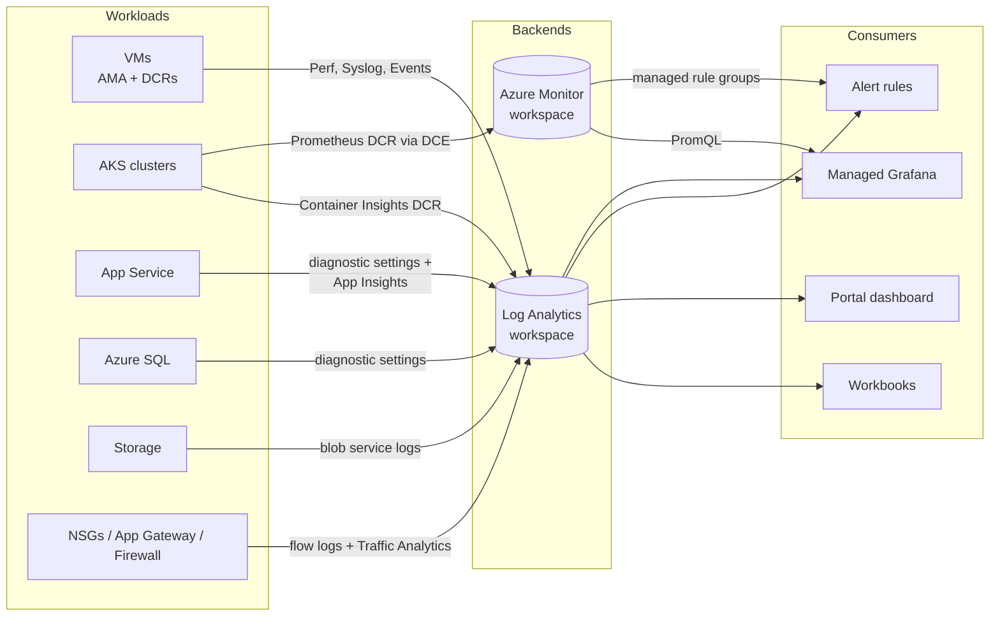
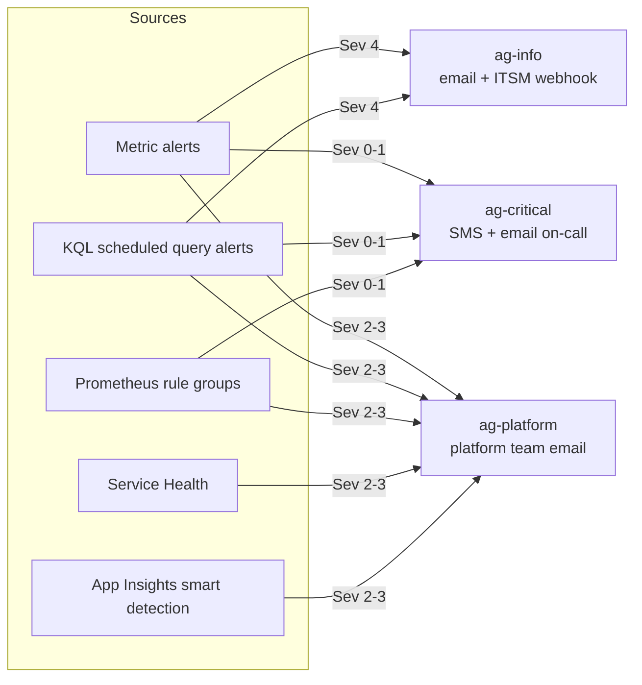

# Architecture

## Telemetry flow

Every signal lands in one of two backends: **Log Analytics** (logs, events,
Container Insights) or the **Azure Monitor workspace** (Prometheus metrics).
Dashboards and alerts read from those two places only — no per-team silos.

## Alert routing

Severity decides who is interrupted. Rules never reference receivers
directly — only the three action-group tiers, so on-call rotation changes
touch one tfvars file.

## Terraform module layout

| Module | Owns |
|---|---|
| `log-analytics` | Central workspace, retention/quota, saved searches |
| `application-insights` | Workspace-based component, web tests, smart detection |
| `action-groups` | Three-tier notification routing |
| `diagnostic-settings` | Generic diagnostics fan-out (used by every workload module) |
| `alerts` | Metric + scheduled-query alert factory (used by every workload module) |
| `vm-monitoring` | AMA DCRs (Linux/Windows), associations, VM alert pack |
| `app-service-monitoring` | App/plan diagnostics and alert pack |
| `sql-monitoring` | SQL diagnostics and alert pack |
| `storage-monitoring` | Blob-service logs and alert pack |
| `network-monitoring` | Flow logs, Traffic Analytics, network alert pack |
| `managed-prometheus` | Azure Monitor workspace, DCE, Prometheus rule groups |
| `aks-monitoring` | Container Insights + Prometheus DCRs, AKS alert pack |
| `grafana` | Managed Grafana, workspace integration, RBAC |

Workload modules follow one contract: they receive resource IDs (the platform
never creates workloads), the central workspace ID, and the action-group tier
IDs; they compose the two generic modules rather than declaring their own
diagnostic/alert resources. Empty input maps provision nothing, so every
environment enables exactly the workloads it has.

## Design invariants

- **Zero stored credentials.** OIDC workload identity federation everywhere:
  pipeline service connections, Terraform backend (`use_oidc`), provider auth.
  Legacy workspace keys exist as a sensitive output only for the rare agent
  that cannot use managed identity.
- **One workspace per environment,** not per team. Cross-resource correlation
  (`_ResourceId`) is the point of centralised monitoring; cost is controlled
  with caps and the Cost & Ingestion workbook, not fragmentation.
- **Alert severity ↔ action-group tier** is a fixed mapping (0-1 critical,
  2-3 platform, 4 info). A new alert chooses a severity, and routing follows.
- **Approvals live on ADO Environments,** never in YAML, so a pipeline edit
  cannot bypass the production gate.
- **Applies run saved plans.** The apply stage executes the reviewed plan
  artifact; it never re-plans.
- **Dashboards and workbooks are JSON in the repo,** deployed by Terraform —
  portal edits are exports back into a PR, not drift.
